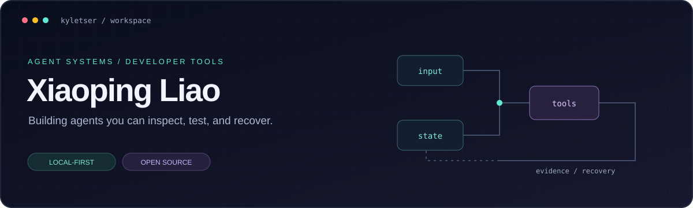
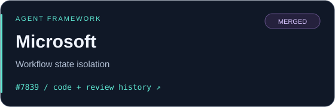
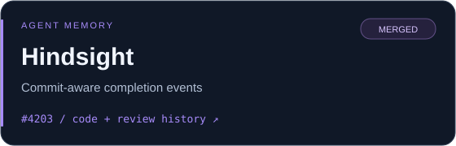
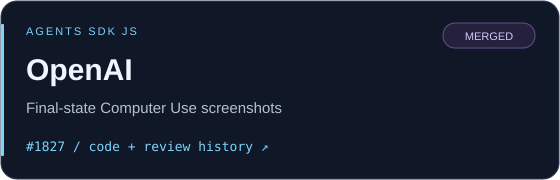
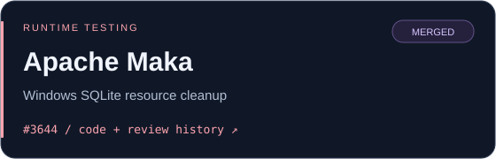

  

  <a href="#selected-projects">01 · Projects</a> &nbsp; / &nbsp;
  <a href="#merged-contributions">02 · Open source</a> &nbsp; / &nbsp;
  <a href="#engineering-focus">03 · Engineering</a> &nbsp; / &nbsp;
  <a href="https://github.com/kyletser?tab=repositories">Repositories</a>

I build **agent systems that can be inspected, tested, and recovered** — from local-first coding tools to knowledge-grounded learning agents.

  <code>Python</code> <code>TypeScript</code> <code>Agent runtimes</code> <code>MCP</code> <code>Knowledge graphs</code>

<strong>Upstream contributions merged in</strong> 
<a href="https://github.com/microsoft/agent-framework/pull/7839">Microsoft Agent Framework</a> &nbsp; · &nbsp;
<a href="https://github.com/openai/openai-agents-js/pull/1827">OpenAI Agents SDK</a> &nbsp; · &nbsp;
<a href="https://github.com/vectorize-io/hindsight/pull/4203">Hindsight</a> &nbsp; · &nbsp;
<a href="https://github.com/apache/maka/pull/3644">Apache Maka</a>

## Selected projects

<table>
<tr>
<td width="50%" valign="top">

01 / BUILD &amp; EXECUTE

<h3><a href="https://github.com/kyletser/coderook">CodeRook ↗</a></h3>

<strong>A local-first coding agent.</strong>

Durable sessions, explicit permissions, reviewable changes, and evidence-backed runs. TUI and web clients share a persistent daemon.

<code>Agent runtime</code> <code>Developer tools</code>

<a href="https://github.com/kyletser/coderook#readme">Overview</a> · <a href="https://github.com/kyletser/coderook/tree/HEAD">Source</a>

</td>
<td width="50%" valign="top">

02 / RETRIEVE &amp; LEARN

<h3><a href="https://github.com/kyletser/coursepilot">CoursePilot ↗</a></h3>

<strong>A knowledge-grounded learning agent.</strong>

Course Q&amp;A and study paths grounded in teacher-reviewed material, with knowledge graphs and reproducible evaluation reports.

<code>Retrieval</code> <code>Knowledge graphs</code>

<a href="https://github.com/kyletser/coursepilot#readme">Overview</a> · <a href="https://github.com/kyletser/coursepilot/tree/HEAD">Source</a>

</td>
</tr>
<tr>
<td width="50%" valign="top">

03 / ORCHESTRATE &amp; INSPECT

<h3><a href="https://github.com/kyletser/plinth">Plinth ↗</a></h3>

A local runtime for inspectable agent workflows and durable run evidence.

<code>Workflow runtime</code> <code>Run evidence</code>

</td>
<td width="50%" valign="top">

04 / RANK &amp; REVIEW

<h3><a href="https://github.com/kyletser/work-hunter">work-hunter ↗</a></h3>

A local job-search assistant with AI ranking and human approval before outreach.

<code>Human-in-the-loop</code> <code>Applied agents</code>

</td>
</tr>
</table>

## Merged contributions

Selected contributions to upstream agent frameworks and runtime tooling. Each link includes the implementation and review history.

  
  
  
  

Technical details of the merged work

| Upstream | Contribution | PR |
| :--- | :--- | :---: |
| **Microsoft · Agent Framework** | Declarative DevUI message input, fresh-run state isolation, and deterministic checkpoint regression tests | [#7839 ↗](https://github.com/microsoft/agent-framework/pull/7839) |
| **Hindsight** | Defer retain completion callbacks until store commit so event counts reflect committed memory | [#4203 ↗](https://github.com/vectorize-io/hindsight/pull/4203) |
| **OpenAI · Agents SDK JS** | Remove redundant Computer Use screenshots; cover direct execution, approval resume, and replay | [#1827 ↗](https://github.com/openai/openai-agents-js/pull/1827) |
| **Apache Maka** | Close SQLite stores before test workspace cleanup on Windows | [#3644 ↗](https://github.com/apache/maka/pull/3644) |

### Contribution pipeline

Beyond the merged work above, my submitted patches cover agent memory, MCP, SOP discovery, browser tooling, and execution reliability.

<strong>Explore submitted patches →</strong>

These submissions are separate from the merged contributions above. Follow each link for its current upstream status and review history.

- [Hindsight #4334](https://github.com/vectorize-io/hindsight/pull/4334) — isolate background Git stderr so failed probes do not corrupt the Pi host TUI.
- [Hindsight #4333](https://github.com/vectorize-io/hindsight/pull/4333) — validate card candidates so memory redaction preserves technical numbers and UUIDs.
- [OpenHands SDK #4717](https://github.com/OpenHands/software-agent-sdk/pull/4717) — launch-time skill overlays for profile-based ACP agents.
- [OpenHands Docs #770](https://github.com/OpenHands/docs/pull/770) — companion documentation for launch-time overlays.
- [MCP TypeScript SDK #2699](https://github.com/modelcontextprotocol/typescript-sdk/pull/2699) — bounded validator caching for schemas without usable IDs.
- [Strands Agent SOP #78](https://github.com/strands-agents/agent-sop/pull/78) — deterministic recursive discovery of external SOPs.
- [Browser Harness #659](https://github.com/browser-use/browser-harness/pull/659) — detect windowless Chrome before the browser handshake.
- [CLI-Anything #455](https://github.com/HKUDS/CLI-Anything/pull/455) — FreeCAD primitive center-of-mass calculations and project reload regressions.
- [TencentDB Agent Memory #1141](https://github.com/TencentCloud/TencentDB-Agent-Memory/pull/1141) — propagate knowledge-server startup failures.
- MiniCode — [configuration precedence #45](https://github.com/LiuMengxuan04/MiniCode/pull/45), [unchanged-file read deduplication #46](https://github.com/LiuMengxuan04/MiniCode/pull/46), and [context compaction / retry #48](https://github.com/LiuMengxuan04/MiniCode/pull/48).

## Engineering focus

| Boundary | What I work on | Upstream example |
| :--- | :--- | :--- |
| **State → Recovery** | Fresh-run isolation, checkpoints, resumable execution | [Microsoft: workflow state](https://github.com/microsoft/agent-framework/pull/7839) |
| **Action → Observation** | Tool execution, approval paths, useful feedback | [OpenAI: Computer Use screenshots](https://github.com/openai/openai-agents-js/pull/1827) |
| **Write → Completion** | Commit ordering, lifecycle cleanup, reliable evidence | [Hindsight: retain completion](https://github.com/vectorize-io/hindsight/pull/4203) |

My review checklist: reproduce the failure → add a regression test → verify the fix → check the failure returns without it.

---

State belongs to a run. Observations follow actions. Completion follows commit.

